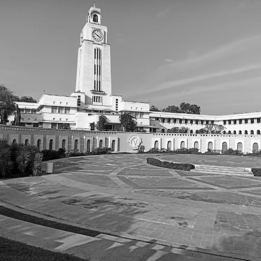
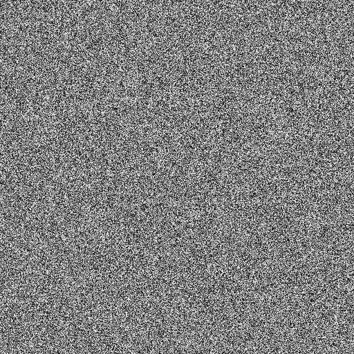
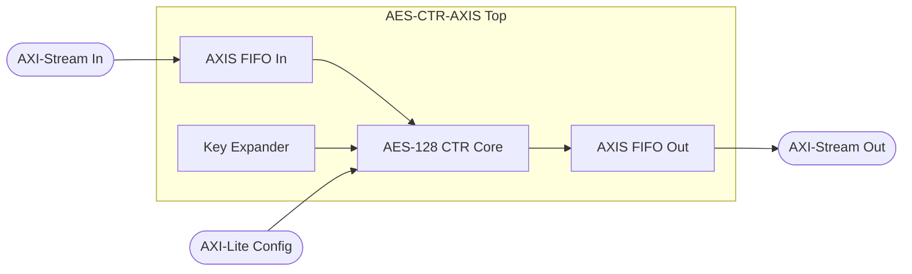

# AES-128 Image Encryption on FPGA

A hardware implementation of AES-128 encryption in CTR mode, designed for image encryption. Includes full RTL design, AXI-Stream interfaces, and comprehensive simulation testbenches.

## Features

- **AES-128 CTR Mode** - Symmetric encryption with counter mode for streaming data
- **AXI-Stream Interface** - Industry-standard streaming protocol for high throughput
- **AXI-Lite Control** - Register-based configuration interface
- **Image Processing Pipeline** - Complete encrypt/decrypt flow for grayscale images
- **Simulation Verified** - Extensive testbenches with NIST test vectors

## Project Structure

```
├── rtl/                    # Synthesizable Verilog modules
│   ├── aes_core.v          # Main AES-128 encryption core
│   ├── aes_ctr_core.v      # CTR mode wrapper
│   ├── aes_round.v         # Single AES round
│   ├── aes_sbox.v          # S-Box lookup table
│   ├── aes_mixcolumns.v    # MixColumns transformation
│   ├── aes_shiftrows.v     # ShiftRows transformation
│   ├── key_expander.v      # On-the-fly key expansion
│   └── ...                 # AXI interfaces, FIFOs, controllers
├── tb/                     # SystemVerilog testbenches
├── tools/                  # Python utilities for image/hex conversion
├── data/                   # Input images and test vectors
├── results/                # Output images (encrypt/decrypt examples)
└── src/                    # Small test vectors
```

## Quick Start

### Prerequisites

- **Icarus Verilog** (`iverilog`, `vvp`) on PATH
- **Python 3** with Pillow (`pip install pillow`)

### Run Simulations

```batch
# Full image encryption pipeline (encrypt → decrypt → PNG output)
.\run_all.cmd

# Quick small-data tests (4 blocks)
.\run_small.cmd

# Unit testbenches (S-Box, MixColumns, Round, Core, etc.)
.\run_units.cmd

# Clean generated files
.\clean.cmd
```

### Custom Image

1. Place your image as `data/input.png` (square, grayscale recommended)
2. Run `.\run_all.cmd`
3. Check `results/` for encrypted and decrypted outputs

## Example Results

| Original | Encrypted | Decrypted |
|----------|-----------|-----------|
|  |  |  |

## Architecture



## Test Vectors

Uses NIST FIPS-197 test vectors for verification:
- **Key**: `2b7e151628aed2a6abf7158809cf4f3c`
- **Plaintext**: `3243f6a8885a308d313198a2e0370734`
- **Ciphertext**: `3925841d02dc09fbdc118597196a0b32`

## Tools

| Script | Description |
|--------|-------------|
| `image_to_coe.py` | Convert image to Xilinx COE format |
| `hex_to_image.py` | Convert hex dump back to image |
| `coe_to_hex.py` | COE to hex conversion |
| `compare_hex.py` | Verify encrypt/decrypt round-trip |

## License

This project is for educational purposes (FPGA coursework).

## Author

Adit Dudani
